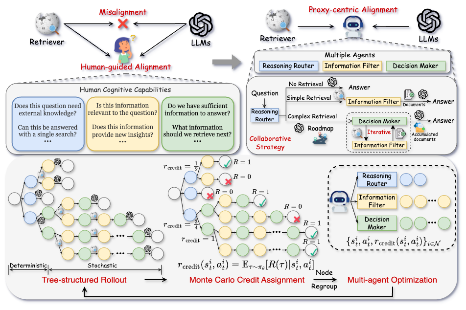

# C-3PO: Compact Plug-and-Play Proxy Optimization to Achieve Human-like Retrieval-Augmented Generation

This repo contains a proxy-centric alignment framework (C-3PO) that bridges the gap between retrievers and LLMs. Instead of modifying existing components in RAG, C-3PO introduces multi-agent system within a lightweight proxy model to simulate humen-like behaviors that optimizes the entire RAG pipeline while maintaining plug-and-play compatibility.

# :pushpin: TODO 

The code and interactive demo are currently under preparation and will be available soon.